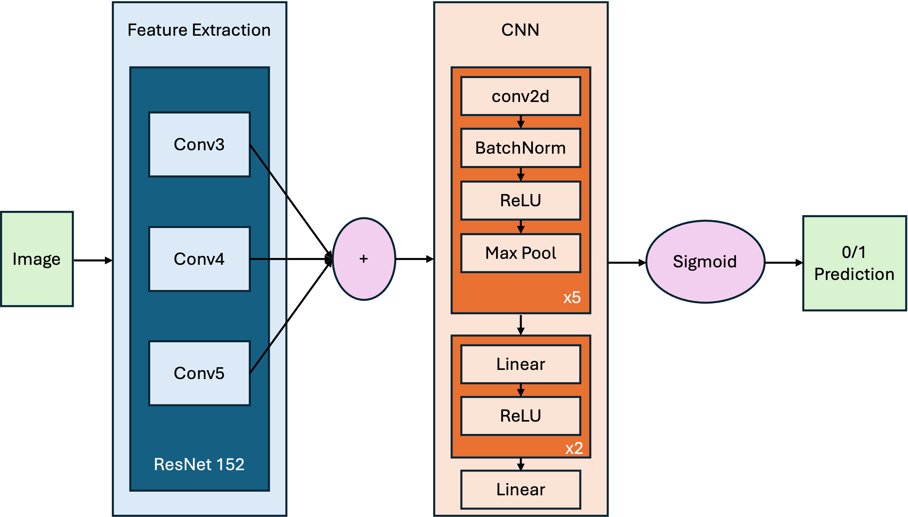

# VisualReasoning-FeatureExtraction

This model network extracts features from three different layers of the ResNet-152 model: conv3, conv4. These multiscale features are fused using a top-down pathway similar to the Feature Pyramid Network (FPN). For instance, features from conv5 are upsampled and merged with conv4 features, followed by further upsampling and fusion with conv3 features. The combined features are then fed into a CNN to produce the final answer prediction.

This model was trained on problems 1, 5, 20, and 21 of the Sythetic Visual, with 400k samples per problem for training, 100k for validation, and 100k for testing. Trained over 5 epochs, with learning rate 0.0001, and a batch size of 64, this model acheived the following results for each problem. As a baseline, we also trained the CNN without feature extraction over 10 epochs.

| | Problem 1 | Problem 5 | Problem 20 | Problem 21 |
| -------- | ------- | -------- | ------- | -------- |
| CNN | 0.98 | 0.5 | 0.91 | 0.8 |
| Feature Extraction + CNN | 0.9972 | 0.9986 | 0.9765 | 0.9458